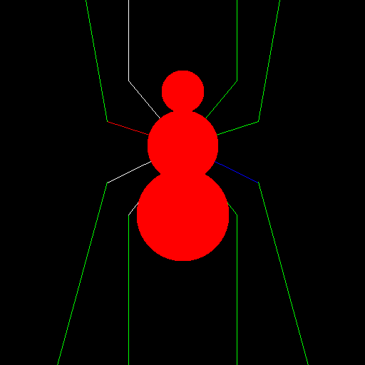

# bitmap renderer lib
  **simple lib to render and generate bmp imgs**\
  **i know i said it twice, but you can render a spider, yay!!!**

### build
  ```bash
  cd bitmap
  make
  ./bmp
  // whatever img render you have, i use feh
  feh output.bmp
  ```

### usage

  ```cpp
  // writing to output.bmp in binary mode
  ofstream fout("output.bmp", ios::binary);

  BmpHeader bmpHdr;
  BmpInfoHeader bmpInfoHdr;
  // a buffer to store pixels and write them to output file
  Pixel img[HEIGHT][WIDTH];

  // write the headers to output file by size offset
  fout.write((char *)&bmpHdr, BMP_HDR_SIZE);
  fout.write((char *)&bmpInfoHdr, BMP_INFO_HDR_SIZE);

  // clear/set pixels to black
  for (int y = 0; y < HEIGHT; y++) {
    for (int x = 0; x < WIDTH; x++) {
      img[y][x] = BLACK;
    }
  }

  draw_spider(img);

  // write the data to output file
  for (int y = HEIGHT - 1; y >= 0; y--) {
    for (int x = 0; x < WIDTH; x++) {
   fout.write((char *)&img[y][x], 3);
    }
  }

  fout.close();
    
  ```
